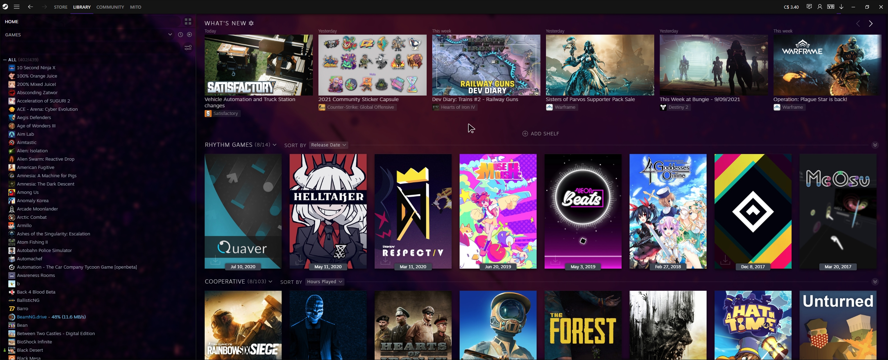

<div align="center">

# TranslucentGlass for Steam Library



</div>

## Installing
Download the theme and move it into your `steamui` folder located in your Steam installation directory.

## Building

Clone the repository:
```shell
git clone https://github.com/MitoKito/SteamAddons.git
cd SteamAddons/Themes/TranslucentGlass
```

In order to build the theme you will need [Sass](https://sass-lang.com/dart-sass).

To compile the Sass, you can run:
```shell
sass src/libraryroot.custom.scss release/libraryroot.custom.css
```
